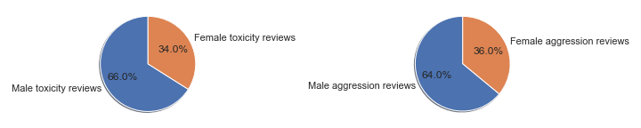
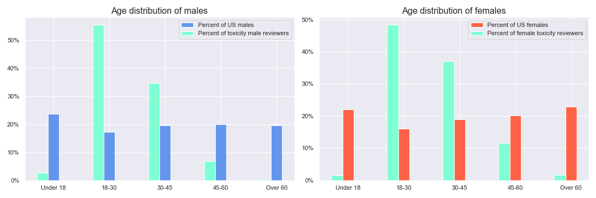
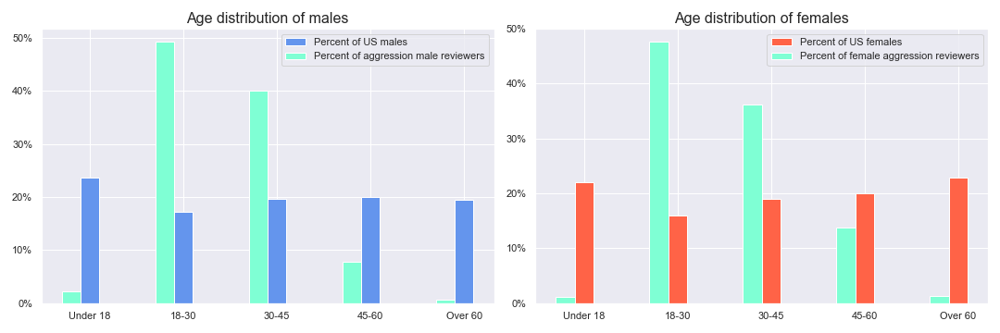
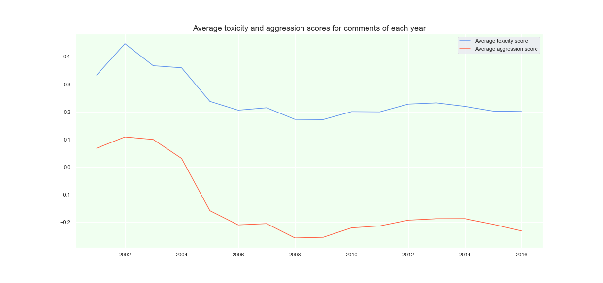

# Evaluating Bias in the Wikimedia Detox Dataset
This repository contains an exploration of biases present in the wikimedia detox dataset ([See here for Detox wiki](https://meta.wikimedia.org/wiki/Research:Detox)). 

The wikimedia detox datasets are a crowdsourced collection of datasets where reviewers evaluated wikipedia discussion comments for aggression, toxicity and whether the comments should be considered an attack. In this notebook we explore some of the properties of the aggression and toxicity datasets from the wikimedia detox dataset collections, as well as some of the relationships between the two, with the purpose of identifying biases in the data. 

Specifically, we look at the distribution of reviewer's genders and age groups. We further analyze how reviews differed across these different gender and age groups. The reason for looking at the group disparities in scoring the data is to determine how the data is biased by a dearth of representation from some of these groups.

Additionally, we take advantage of US census data to get an idea of how the demographics of the reviewers compares to the population at large. With respect to this comparison it should be mentioned that it is itself an approximate comparison, since 1) not all reviewers need be members of the US population, 2) not all reviewers elected to report their demographics, and those that elected to report may not be representative of the group that did, and 3) the census data is itself an estimate of the population. This information is used to understand how representation of the reviewer age groups differs from the US population. This is used in conjunction with analysis of disparities in scoring across groups to estimate a direction of bias in scoring when compared to what would be expected from a random sample of reviewers taken from the US population.

We also we examine how evaluations of toxicity and aggression change based on what year the comment was from. This is done to determine how stable the scores for comments over time. 

After the analysis and discussion we follow up on some questions regarding the use of this data to create tools such as those built on the Perspective API. The Perspective API is a google project that uses models trained on the Detox data to assess the potential impact that a comment will have on conversations (see below for more links.)

## Links to information about Detox datasets

[Page describing Detox datasets](https://meta.wikimedia.org/wiki/Research:Detox/Data_Release)

[Toxicity figshare datasets](https://figshare.com/articles/Wikipedia_Talk_Labels_Toxicity/4563973)

[Aggression figshare datasets](https://figshare.com/articles/Wikipedia_Talk_Labels_Aggression/4267550)

## Links relating to Google Perspective API
[Perspective API landing page]( https://www.perspectiveapi.com/#/)

[Perspective API Github](https://github.com/conversationai/perspectiveapi/blob/master/2-api/methods.md)

[Gallery with projects built using the Perspective API](https://github.com/conversationai/perspectiveapi/wiki/perspective-hacks)

## Links to outside resources 
[National Population by Characteristics 2010-2019 Census.gov page](https://www.census.gov/data/tables/time-series/demo/popest/2010s-national-detail.html)

[United states population by age and sex](https://www2.census.gov/programs-surveys/popest/technical-documentation/file-layouts/2010-2019/nc-est2019-agesex-res.csv)

[Documentation for the data](https://www2.census.gov/programs-surveys/popest/technical-documentation/file-layouts/2010-2019/nc-est2019-agesex-res.pdf) 

## Here are some images produced during the analysis
First the gender breakdown of reviewers for both reviewers of toxicity and reviewers of aggression:

Now we look at the age distribution of toxicity reviewers compared to US census estimates:

Now the same comparison, but for aggression reviewers:

And here is a graph showing the change in average review over the years. The lower the number the more aggressive/toxic the comment was rated. Note that aggression is on average rated higher than toxicity.

